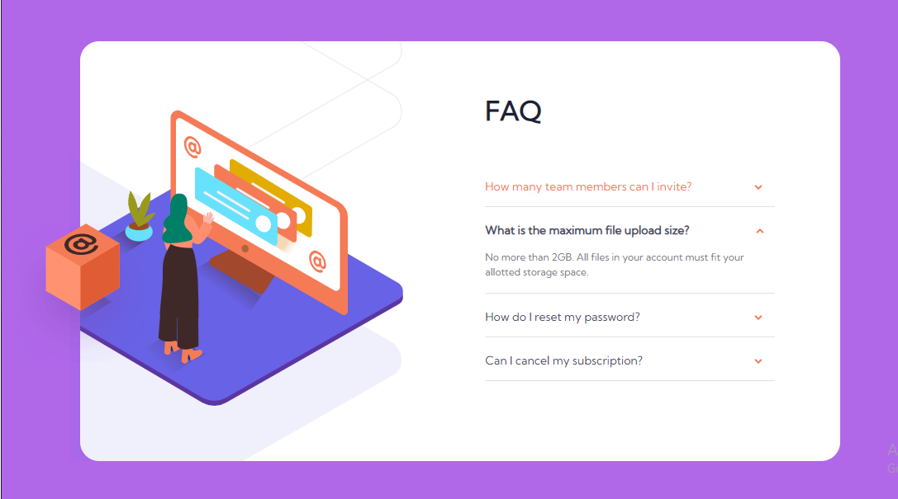

# Frontend Mentor - FAQ accordion card solution

## Welcome to my project guys! 👋

## Table of contents

- [Overview](#overview)
  - [The challenge](#the-challenge)
  - [Screenshot](#screenshot)
  - [Links](#links)
- [My process](#my-process)
  - [Built with](#built-with)
  - [What I learned](#what-i-learned)
  - [Continued development](#continued-development)
  - [Useful resources](#useful-resources)
- [Author](#author)
- [Acknowledgments](#acknowledgments)

## Overview

Thanks for checking out this front-end project which was inspired by [Frontend Mentor](https://www.frontendmentor.io) and i did the best i could to provide you with the cleanest and accurate codes for different devices. I hope this challenge codings help you improve your coding skills by building realistic projects.

Remember that "Every day is a learning day", so let's checkout the requirements to start such project

### The challenge

In his project you should be able to:

- View the optimal layout for the component depending on their device's screen size
- See hover states for all interactive elements on the page
- Hide/Show the answer to a question when the question is clicked

### Screenshot




### Links

- Live Site URL: [FAQ accordion card solution](https://ellefamkar.github.io/FAQ-accordion-card-solution/)

## My process

### Where to find resources

We know what we need first, yes! you are right, the design file. So let's checkout [Fimga](https://www.figma.com/file/bsNhkrS5df2O80AoccpQmR/faq-accordion-card?node-id=0%3A2) to find even the smallest details about the style requirements of this project such as `font-size`, `padding` and `margin` as well as finding all the required assets in the `/images` folder. The assets are already optimized. `color palette` is also available in figma file to guide you to choose the accurate colors.

### Built with

- Semantic HTML5 markup
- CSS custom properties
- Flexbox
- CSS Grid
- Bootstrap
- Mobile-first workflow
- Vanila javascript

You can use any tools you like to help you complete the project. So if you got something you'd like to practice, feel free to give it a try. However, i wrote this design with simple html5 and css along with bootstrap and js and made it responsive for all the devices, since my users should be able to: View the optimal layout and hover or active states depending on their device's screen size. 

### What I learned

This projects helped me being more familiar with the details of html, css and js and i was able to use my js and css knowledge together create a responsive project with small details on colors,sizes and so on. It was a great experience to built such a project with such different positionings. However, at the middle of the project i found it was better to use more css instead of depending on bootstrap for style,since such projects which need more accurate details are better written with pure css.

To see parts of my codes and see how you can add code snippets, see below:

```html
<div class="accordion__item position-relative border-bottom">
   <p class="acc__heading">How do I reset my password?</p>
   <p class="acc__content">Click “Forgot password” from the login page or “Change password” from your profile page. A reset link will be emailed to you.</p>
 </div>
```
```css
.acc__heading:not(.active-arrow):hover {
   color: var(--font-active);
}

.acc__heading::after {
   content: url(../assets/images/icon-arrow-down.svg);
   position: absolute;
   right: 15px;
   top: 0px;
   width: 10px;
   height: 10px;
}

```
```js
accordionHeading.forEach((item)=>{
    item.addEventListener('click',(e)=>{
        console.log( e.target.innerText);
        e.target.classList.toggle('header-fw-bold');
        e.target.classList.toggle('active-arrow');
        e.target.nextElementSibling.classList.toggle('active');
     
    });
});
```

### Continued development

In my future projects, not only i am going to focus on improving my basic knowledge of front end development (html and css), but also i will make it more dynamic and use javascript so as to create cooler projects. I will also try to be much more familiar with UI design so as to better understand my clients needs and requirements.

### Useful resources

In order to do this project in a correct way you need to have a good knowledge of html and css especially flex and grid and you need to know how to use js in the project and connect it to css if you want to use js,However, this is possible to built it just with pure css. so let's master at them with these fruitful resources.

- [w3schools](https://www.w3schools.com/)
- [MDN](https://developer.mozilla.org/en-US/) - Remember that no matter how many tutorial videos you have watched, you always need to learn details and features from codes documentations
- [codeacademy](https://www.codecademy.com/)
- [udemy](https://www.udemy.com/) - Here you can find a number of tutorials in different languages
- [coursera](https://www.coursera.org/)

To my persian friends:
You can benefit from this complete article on which sources to use to master flex and grid.

- [Elle Famkar - Virgool](https://vrgl.ir/2alVC) 

## Author

- Website - My website is under construction but you can find my works here : [Elle Famkar](https://github.com/ellefamkar)
- Twitter - [@Ellefamkar](https://www.twitter.com/ellefamkar)

Feel free to ask any questions come to your mind on my github account!

## Acknowledgments

I want to thanks my Frontend mastering course mentor, [Devedoping](https://devedoping.ir/), who has been inspiring and helpfull with great projects, tips and lessons. 


**Have fun using this project!** 🚀